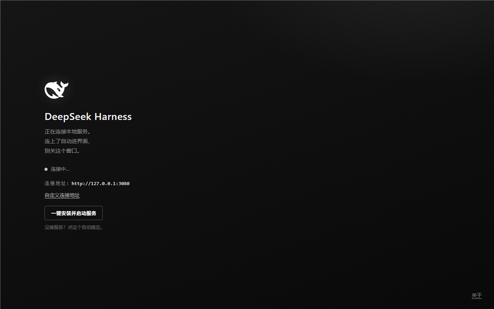

# DeepSeek Harness 桌面壳

白鲸小窗。DeepSeek Harness 的自包含桌面版，一个独立 exe，不依赖系统浏览器。

## 截图



## 这是什么

- 单文件 exe，内置 Chromium（Electron 43），**不装浏览器也能跑**
- 白底黑鲸圆角图标，黑白灰启动页
- 启动页支持**自定义连接地址**，默认连 `http://127.0.0.1:3080`
- 地址会记住，下次启动直接连
- **v1.0.1 起支持一键安装服务**：自动拉官方仓库、装依赖、构建、启动、连接

## 怎么用

两种装法，推荐安装版：

1. **安装版（推荐）**：跑 `DeepSeek-Harness-Setup-*.exe`，装到用户目录，以后秒开（实测 0.6s 出窗口）
2. **便携版**：单文件 `DeepSeek-Harness.exe`，免安装，但每次启动要解压 ~350MB，慢得多（实测 7.4s）

然后：
3. 已装服务 → 自动连上
4. 没装服务 → 点「**一键安装并启动服务**」，全自动搞定
5. 连远程实例 → 点「自定义连接地址」改 IP
6. 右下角「DeepSeek 用量 / 关于」→ 用量页 / GitHub 仓库

### 一键安装要求

- `git`
- `Node.js` ≥ 22.19
- `pnpm` 不要求：有就用，没有自动走 corepack / npx 兜底

安装过程：`git clone`（浅克隆）→ `pnpm install` → `pnpm run build` → `pnpm dsh web`（后台常驻，日志在 `%USERPROFILE%\dsh-service\deepseek-harness\dsh-web.log`）。首次要几分钟，进度条实时显示。

## 开发

```bash
npm install
npm start        # 本地跑
npm run dist     # 出两个：安装版（dist/DeepSeek-Harness-Setup-*.exe）+ 便携版（dist/DeepSeek-Harness.exe）
node_modules/electron/dist/electron.exe make-screenshot.js  # 重新生成 README 截图
```

> 国内网络：GitHub 拉不到 Electron 时，装依赖前先设镜像
> ```bash
> $env:ELECTRON_MIRROR = "https://npmmirror.com/mirrors/electron/"
> ```

> 自测一键安装 UI：`$env:DSH_SIM_INSTALL = "1"` 再启动，走模拟流程

## 结构

| 文件 | 干啥的 |
|---|---|
| `main.js` | 主进程：探测服务、动态地址、一键安装、IPC |
| `preload.js` | 渲染桥接，暴露 `window.dsh` |
| `fallback.html` | 启动页（黑白灰 + 自定义地址 + 一键安装 + 关于） |
| `make-icon.js` | SVG → 多尺寸 ICO 的渲染脚本 |
| `make-screenshot.js` | 启动页截图脚本 |
| `icon-source.svg` | 鲸鱼图标源文件 |

## 许可

MIT
